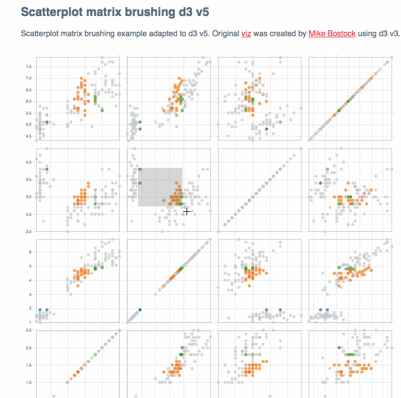

# scatterplot-matrix-brushing-d3v5

Credits: https://bl.ocks.org/mbostock/4063663

Scatterplot matrix brushing example adapted to d3 v5.
Original <a href="https://bl.ocks.org/mbostock/4063663">viz</a> was created by <a href="https://github.com/mbostock">Mike Bostock</a> using d3 v3.


## Build and run locally

```sh
yarn install
yarn start
```
Navigate to http://localhost:9000/

Production build:

```sh
yarn build
```

## Demo

Demo: <a href="https://djamshed.github.io/scatterplot-matrix-brushing-d3v5/dist/">Scatterplot matrix brushing example adapted to d3 v5</a>

